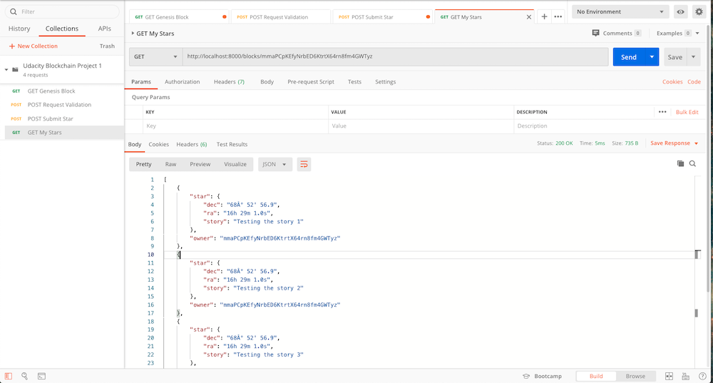

# Private Blockchain Application

## Run the application

Clone this repo to your local computer and proceed with the following steps.

**Install dependencies**

```
npm install
```

**Run Jest tests**

```
npm run test
```

**Start the application**

```
npm run start
```

## Testing using POSTMAN

Below are the results of testing using POSTMAN

1. Run your application using the command `npm run start`
You should see in your terminal a message indicating that the server is listening in port 8000:
> Server Listening for port: 8000

2. To make sure your application is working fine and it creates the Genesis Block you can use POSTMAN to request the Genesis block:
    
3. Make your first request of ownership sending your wallet address:
    
4. Sign the message with your Wallet:
    
5. Submit your Star
     
6. Retrieve Stars owned by me
    

## VSCode Debugging the app or with Jest

If you want to start the debugger and attach to the running application instance or running Jest tests, then you can use VSCode launch configurations file to do so `launch.json`. For this project, I am using the following configurations:

```
{
  "version": "0.2.0",
  "configurations": [
    {
      "type": "node",
      "request": "launch",
      "name": "Launch Program",
      "skipFiles": [
        "<node_internals>/**"
      ],
      "program": "${workspaceFolder}/start.js"
    },
    {
      "type": "node",
      "request": "launch",
      "name": "Jest Tests",
      "internalConsoleOptions": "openOnSessionStart",
      "program": "${workspaceFolder}/node_modules/jest/bin/jest"
    }
  ]
}
```